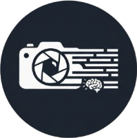

<p align="center">
  <a href="https://image2text-engine.streamlit.app/" target="_blank">
    
  </a>
</p>

<p align="center">
  <a href="https://image2text-engine.streamlit.app/" target="_blank">
    
  </a>
</p>

<h1 align="center">Image2Text-Engine</h1>

<div align="center">

[](https://www.python.org/)
[](https://streamlit.io/)
[](https://huggingface.co/docs/transformers/index)
[](https://huggingface.co/Salesforce/blip-image-captioning-large)
[](https://github.com/syfax-am/Image2Text-Engine/blob/main/LICENCE)

Powered by BLIP Large / Base and modern NLP models

</div>

---

##  Features

* AI Image Captioning powered by BLIP Base & Large, with customizable generation settings.

* Safety & Moderation including NSFW detection and caption toxicity filtering.

* Automatic SEO Metadata with keywords and optimized meta descriptions.

* Batch Processing for ZIP files with exportable results (CSV/JSON).

---
##  Examples
Here are a few sample captions generated with the application:

### Example 1
<p align="center">
  
</p>

### Example 2
<p align="center">
  
</p>

---

##  Use Cases

* Automated content creation for blogs, CMS, and media platforms

* ALT text generation to improve accessibility

* Product descriptions & SEO metadata for e-commerce

---

##  Quick Start

- Python **3.12+**

1. **Clone the Repository**
```bash
git clone https://github.com/syfax-am/Image2Text-Engine.git
cd Image2Text-Engine
```

2. **Create virtual environment** (recommended)
```bash
python -m venv venv
venv\Scripts\activate
```
3. Install dependencies
```bash
pip install -r requirements.txt
```
4. Run the application
```bash
streamlit run app.py
```
---

###  Future Improvements

- [ ] Implement Grad-CAM for BLIP encoder

- [ ] Add multilingual captioning

- [ ] GPU acceleration option in UI

- [ ] Add FastAPI backend for API usage

---

<p align="center"> <a href="https://www.linkedin.com/in/syfax-ait-medjber/">  </a> </p>